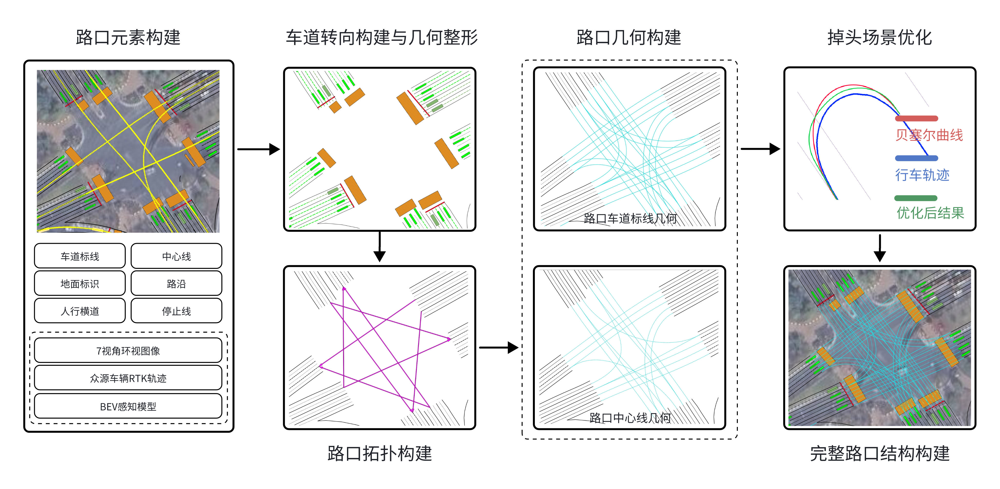

Here are all the projects I done before by myself or collaborate with others, feel free to explore!

- [Crowd-sourced Mapping Accuracy Evaluation System 众源建图精度自动评测系统](#crowd-sourced-mapping-accuracy-evaluation-system)
- [Crowd-sourced Mapping Intersection Automatic Construction 众源地图路口结构自动生成](#crowd-sourced-mapping-intersection-automatic-construction)
- [Hybrid A* Application 混合A*掉头曲线生成](#hybrid-a-application-in-intersections-u-turn-line-generation)
- [UGV Robot Experiments UGV机器人实验](#ugv-robot-experiments)
- [Dynamic Programming 动态规划](#dynamic-programming)
- [CEC Control 循迹控制](#cec-control)

## Crowd-sourced Mapping Accuracy Evaluation System 众源建图精度自动评测系统
In the field of autonomous driving mapping, in addition to the traditional high-precision (HD) maps and real-time mapping that relies entirely on perception, a mainstream method is crowd-sourced mapping. By uploading the perception results of the vehicle side, multiple trips and a large amount of data are collected in the cloud for automatic aggregation to achieve a crowd-sourced map with high accuracy, low cost, and high freshness. Crowd-sourced maps can well assist downstream planning and control modules in autonomous driving.

Our solution leverages the MapTR V2 model as a baseline for improvement. This trained model is adept at identifying ground elements, such as lane markings. Within the cloud module, my responsibilities include developing the incremental fitting module with multi-frame perception, the matching module of perception map and base maps, the variation detection module, and the automatic fusion module. Each of these modules plays a crucial role in our solution, contributing to its overall effectiveness.

Among them, I designed a complete set of map evaluation and fusion system based on base map matching. This system can segment the new perception results based on the historical information of the base map and calculate the absolute mean error (MAE) and the mean relative error (MRE) of the lines to measure the perception quality. The detection result will be used as the input of map fusion, vital in determining the fusion confidence. 

在自动驾驶测绘领域，除了传统的高精度地图和完全依赖感知的实时测绘外，一种主流的方式是众包测绘。通过上传车端的感知结果，将多趟行程和大量数据收集到云端进行自动聚合，实现高精度、低成本、高新鲜度的众包地图。众包地图可以很好地辅助自动驾驶下游的规划和控制模块。

我们的解决方案以MapTR V2模型为改进基线，这个训练好的模型擅长识别地面要素，比如车道线。在云端模块中，我的职责包括开发多帧感知的增量拟合模块、感知地图与底图的匹配模块、变化检测模块和自动融合模块。这些模块中的每一个都在我们的解决方案中扮演着至关重要的角色，对整体效果起到了贡献作用。

其中，我设计了一整套基于底图匹配的地图评估和融合系统。该系统能够根据底图历史信息分割出新的感知结果，并计算出各条线的绝对平均误差（MAE）和平均相对误差（MRE）来衡量感知质量，检测结果将作为地图融合的输入，决定融合的置信度。

<figure>
  
  

    <figcaption>map evaluation and fusion system pipeline</figcaption>
   
 
</figure>

The variation results shown above are obtained from real experiments in Guangzhou's downtown. The scenario shows a complicated intersection mixing highway and city road. The right-hand side result is the fusion result achieved by automatic fusion and manual validation.

上图的变化结果为在广州市区进行的实际实验，场景为高速公路与城市道路混合的复杂路口，右侧结果为自动融合与人工验证后的融合结果

Our work in perception model (Received by WACV 2025)
-  [PrevPredMap: Exploring Temporal Modeling with Previous Predictions for Online Vectorized HD Map Construction](https://arxiv.org/abs/2407.17378)
- my contributions involves in whole training data support and map vector result post-process

我们在感知模型的工作（已被WACV 2025接收）
-  [PrevPredMap: Exploring Temporal Modeling with Previous Predictions for Online Vectorized HD Map Construction]
- 我的主要贡献涉及整个训练数据支持和地图矢量结果后处理工作

## Crowd-sourced Mapping Intersection Automatic Construction 众源地图路口结构自动生成

This is an automatic intersection construction solution based on crowd-sourced mapping design. Compared with traditional technologies, it can automatically construct the topology of urban intersections without relying on crowd-sourced trajectory big data. It generates a virtual turning reference line with drivability based on the turning information of the lanes, and uses curvature as the geometric constraint of the virtual reference line of the intersection. It assists the planning and control tasks of intelligent driving downstream.

这是一种基于众源建图设计的自动化路口构建方案，相较传统技术，可以不依赖众源轨迹大数据，自动化的构建城市路口拓扑，并通过车道的转向信息，以曲率作为路口虚拟参考线几何约束，生成具有可行驶性的虚拟转弯掉头参考线，辅助智能驾驶下游的规划控制任务。

<figure>
  
  

    <figcaption>Crowd-sourced Mapping Intersection Automatic Construction pipeline</figcaption>
   
 
</figure>

|Intersection Crowd-sourced Trajectories 众源轨迹|Construction results 生成结果|
|-|-|
|||

## Hybrid A* Application in Intersection's U-turn Line Generation

Autonomous vehicles face challenges navigating complex urban roads, particularly at intersections. The virtual line, e.g. the u-trun lines are used to represent the topology geometry assisting the downstream planning and control. The virtual lines in map usually have the strtic curvature requirement which the traditional curve generator cannot guareteen. This study novetlty proposes an approach using a search-based planning algorithm in curve generation. The main features are:

1. The vehicle kinematic model uses constant speed and continuous integration to express the state transfer equation.
2. The generated curve's global maximum curvature is guaranteed.
3. Adaptive curve smooth parameters mechanism for lane scenario variation

自动驾驶车辆在复杂的城市道路上导航时面临挑战，特别是在交叉口。虚拟线，例如掉头线，用于表示拓扑几何，辅助下游规划和控制。地图中的虚拟线通常具有静态曲率要求，传统的曲线生成器无法保证。本研究提出了一种使用基于搜索的规划算法来生成曲线的方法。主要特点是：

1. 车辆运动学模型使用恒定速度和连续积分来表示状态转移方程。
2. 保证生成的曲线的全局最大曲率。
3. 适应车道场景变化的曲线平滑参数机制

|Animation|Simplified Ackermann-Drive Kinematic Model|U-turn Scenario|
|-|-|-|
||||

In our experiments, a maximum curvature of 0.1740 is the best among the four methods, and the curvature pass rate is greatly improved to 81.48%. In terms of the maximum curvature change and the maximum curvature change $\sigma$, both are improved from the plain version. It is proved that our method can improve the curvature pass rate while maintaining a certain degree of smoothness, meeting the requirements of curvature and smoothness.

在我们的实验中，我们与朴素A*、四阶贝塞尔曲线和真实行车轨迹进行了比较。其中，我们的方法最大曲率为0.174为最优结果，整体的曲率通过率大大提高到81.48%。在最大曲率变化和最大曲率变化$\sigma$方面，都比朴素A*算法有所改进。证明了我们的方法可以在保持一定的平滑度的同时提高曲率通过率，并满足曲率和平滑度的要求。

<figure>
  
  

    <figcaption>statistic results with the experiments in 30 urban intersections</figcaption>
  

</figure>

<!-- ## Jump Point Search Algorithm
A 2D target chasing problem solving by JPS algorithm -->

## UGV Robot Experiments 机器人实验

This part includes the UGV robot experiments in the ERL lab at UCSD. The main contributions are the application and configuration of open-sourced algorithm packages, such as Hector Mapping, LIMO-3D SLAM, TARE Planner to our Jackal robot. It requires the understanding both the algorithm and the robot's hardware. The following results are manipulated in real-time in Rviz visualization.

这部分包括了在加州大学圣地亚哥分校ERL实验室进行的UGV机器人实验。主要贡献是将开源算法包，如Hector Mapping，LIMO-3D SLAM，TARE Planner应用和配置到我们的Jackal机器人上，其中都需要对算法，机器人硬件和ROS系统有较深的理解。以下结果均在Rviz可视化中的实时操作录屏。

|Real-time Manipulation in Rviz Visualization||
|-|-|
|Hector Mapping|Frontier-based Exploration|
| ||
|LIMO-3D SLAM with Ouster1-32|LIMO-3D SLAM with Ouster1-32|
|||
|TARE Planner in Jackal|iSDDF Planner in Jackal (Self-developed algorithm)|
|||

<!-- ||
|| --> 

<!-- ## Object Detection -->
<!-- ### Bin Detector with Bayes Filter
A vision object detection task to find the blue bin in the pictures

|Detection Box|Mask|
|-|-|
|||
|||
||| -->
<!-- 
### Phone Detector with SVM
A vision object detection task to find the phone in the pictures

|Phone1|Phone2|
|-|-|
||| -->

## Dynamic Programming 动态规划
A 2D Door-Key problem solved by dynamic programming, aims to find the optimal policy.

2D门钥匙问题通过动态规划求解，目的是找到最优策略。

|Single Door Scenario||Two Doors Scenario||
|-|-|-|-|
|||||

## CEC Control CEC循迹控制

|Free Space|Collision Aware|
|-|-|
|||

<!-- ## Optimal Scene Graph Planning with Large Language Model Guidance
 -->

